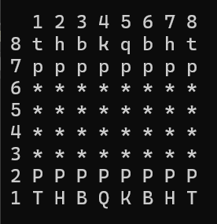

# ♟️ Simulador del juego del Ajedrez
Simulación del juego del ajedrez en C++, jugable mediante terminal.

---

## Índice
1. [Tablero](#id1)
2. [Muestra del tablero](#id2)
3. [Movimiento](#id3)
4. [Fichas](#id4)
5. [Juego](#id5)
6. [Repositorio](#id6)
7. [Creditos](#id7)
8. [Licencia](#id8)

---

## ⬜⬛ Tablero <a name="id1"></a>

- Generación de un tablero.
- Colocación de fichas en posición inicial

[▲ Volver al índice](#índice)

---

## Muestra de la inicialización del tablero <a name="id2"></a>
<div align="center">
  
  
</div>
[▲ Volver al índice](#índice)

---

## 🔛 Movimiento <a name="id3"></a>

El movimiento de las piezas funciona de la siguiente manera, el usuario introduce la posicion inicial que corresponde a la pieza que quiere mover y luego la posicion final que corresponde a la posicion donde la quiere mover, en el codigo ponemos de ejemplo la posicion "12 13" esto como se puede apreciar en la captura corresponde a un movimiento del peon:
<p align="center"></p>
- Los jugadores alternan su turno. Tal y como en el juego original sacan simpre las blancas.
- Si el movimiento no es válido, se le indica al usuario y permitirá un nuevo movimiento.

Todos los movimientos son comprovados por el codigo tanto en que sea un movimiento posible para la ficha es decir un peon no se podra mover mas de 2 fichas en su primer movimiento y mas de 1 en los posteriores, luego tambien verificamos que la posicion donde va la ficha este vacia esto lo hacemos comprovando si hay un asterisco en la posicion de el tablero, por ejemplo con los peones lo hacemos aqui:

<pre>if (yInicio == yFin && tablero[xFin][yFin] == '*' && (xInicio - xFin == 1)) return true;</pre>

Esta linea sirve para avanzar, lo que hace es comprovar que la casilla a la que va este vacia, eso lo hace viendo si el caracter que hay es un asterico o no, y una vez hecho eso le resta 1 a la fila y eso permite "subir" realmente esta bajando pero visualmente sube y devuelve true porque asi la booleana es verdadera y el movimiento se realiza al ser válido.

Con todos los movimientos hemnos añadido esa comprovación y en caso que haya una pieza nos aseguramos que la pueda matar por ejemplo un peón no puede matar avanzando mata en diagonal por lo que si tiene un peon o otra pieza delante no podra avanzar ni matar, esto lo hemos hecho con esta linea:

<pre>if ((xInicio - xFin == 1) && abs(yInicio - yFin) == 1 && islower(tablero[xFin][yFin])) return true;</pre>

Esta linea lo que hacemos es simple la primera parte hace que el peon avanze una posicion luego la siguiente es para que gire a la derecha o a la izquierda, pero lo que hace es comprovar que avanze o gire pero solo una posicion, finalmente verifica que haya una pieza y que sea minuscula, eso nos sirve porque todas las piezas rivales son minusculas por lo que el peón blanco solo puede matar a negras que equivalen a las minuscualas y viceversa.

[▲ Volver al índice](#índice)

---

## Fichas <a name="id4"></a>

En nuestro juego tenemos las mismas fichas y movimientos que en el juego clasico, hemos añadido tambien que cuando el peon llega al final del tablero corona y se convierte en reina, cuando matas a una pieza no la puedes recuperar coronando como se podria hacer en el juego original solo puedes recuperar a la reina, y no hay maximo de reinas.

| Nombre    | Cantidad (por jugador) | Movimiento                  | Elimina                              |
|-----------|------------------------|-----------------------------|--------------------------------------|
| Peón      | 8                      | 1 casilla adelante (2 en primer movimiento) | Diagonal adelante (1 casilla) |
| Torre     | 2                      | Horizontal/Vertical (ilimitado) | Igual que movimiento               |
| Caballo   | 2                      | En "L" (2+1 casillas)       | Igual que movimiento               |
| Alfil     | 2                      | Diagonal (ilimitado)        | Igual que movimiento               |
| Reina     | 1                      | Horizontal/Vertical/Diagonal (ilimitado) | Igual que movimiento    |
| Rey       | 1                      | 1 casilla en cualquier dirección | Igual que movimiento          |

[▲ Volver al índice](#índice)

---

## 🏁 Juego <a name="id5"></a>

- La partida de desarrolla de la siguiente manera, empiezan blancas y continuan negras, entonces se van intercalando hasta que uno de los dos mata al rey rival.

- Para mover las fichas el juego pedirá al usuario que ingrese la posición y el movimiento que va a realizar: ej. a2 a3.

- La ficha se mueve una vez pase las verificaciones, puede avanzar y/o matar a otra ficha.

[▲ Volver al índice](#índice)

---

## 📁 Repositorio <a name="id6"></a>

El repositorio contiene:
```text
ajedrez/
├── 📁 Archivos de encabezado/
│   ├── 📄 const.h
│   └── 📄 logica.h
│
├── 📁 Archivos de origen/
│   ├── 📄 const.cpp
│   ├── 📄 juego.cpp
│   ├── 📄 main.cpp
│   ├── 📄 movimiento.cpp
│   └── 📄 tablero.cpp
│
└── 📁 Otros archivos de configuración
```

[▲ Volver al índice](#índice)

---

## 📚 Creditos <a name="id7"></a>

Practica realitzada por:

- Lluc Omella
- Andualem

[▲ Volver al índice](#índice)

---

Licencia <a name="id8"></a>
--------

Licencia GNU-GPL <[https://www.gnu.org/licenses/gpl-3.0.html](https://www.gnu.org/licenses/gpl-3.0.html)\>

[▲ Volver al índice](#índice)
